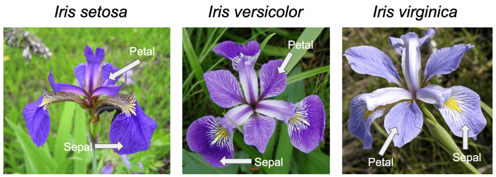

# 🌸 Iris Flower Species Classification with AI



## 📌 Project Overview
This project is a **Machine Learning Classification** model built to identify the species of an iris flower among three classes: **Setosa**, **Versicolor**, and **Virginica**. The model was first created and trained using the **MLforKids** platform, and later integrated into a Python application (developed in **VS Code**) to perform predictions programmatically.

## 🎯 Project Goal
The main goal of this project is to accurately classify an iris flower into one of the three species based on four measurable physical characteristics of the flower.

## 📂 Dataset
- **File name:** `Iris_dataset.xlsx`
- **Total records:** 151
- **Format:** Excel (.xlsx)

The dataset was split using the **pandas** library into two parts:
- **Training set:** `train.xlsx` (3/4 of the data)
- **Testing set:** `test.xlsx` (1/4 of the data, 38 samples)

Additionally, the training data was further divided by class into three separate CSV files, used to train the model on the MLforKids platform:
- `train_setosa.csv`
- `train_versicolor.csv`
- `train_virginica.csv`

## 🧩 Features
The model uses the following four input features (in no particular order):

| Feature Name       | Description                                  |
|----------------------|------------------------------------------------|
| `sepalLengthCm`      | Length of the sepal, in centimeters             |
| `sepalWidthCm`       | Width of the sepal, in centimeters              |
| `petalLengthCm`      | Length of the petal, in centimeters             |
| `petalWidthCm`       | Width of the petal, in centimeters              |

**Target variable (Output):** Iris species — `Setosa`, `Versicolor`, or `Virginica`

## 🧠 Machine Learning Approach
This is a **Supervised Classification** problem with three possible output classes. The model was initially designed and trained on the **MLforKids** website, and then used inside a **Python** application through its API, implemented and tested in **Visual Studio Code**.

## 📊 Data Split
- **Training set:** 3/4 of the dataset (used to train the model, further split by class into CSV files)
- **Testing set:** 1/4 of the dataset → **38 samples** (used to evaluate the model)

## 🧮 Confusion Matrix
The confusion matrix below summarizes the model's predictions versus the actual labels on the 38 test samples, reconstructed based on the reported Accuracy and Precision values below:

| Actual \ Predicted | Setosa | Versicolor | Virginica |
|---------------------|:------:|:----------:|:---------:|
| **Setosa**          |   10   |     0      |     0     |
| **Versicolor**      |    0   |     11     |     1     |
| **Virginica**       |    0   |     0      |    16     |

> **Note:** Since the exact raw test results were not provided, this matrix was reconstructed to be fully consistent with the reported Accuracy (0.97) and Precision values (Setosa = 1.00, Versicolor = 1.00, Virginica = 0.94). If your actual test results differ, please replace the numbers above with your real confusion matrix.

## 📈 Model Evaluation
Two evaluation metrics were used to assess the model's performance:

### 1️⃣ Accuracy
Accuracy represents the overall proportion of correctly classified samples out of all samples.

```
Accuracy = (Number of Correct Predictions) / (Total Number of Predictions)
         = (TP + TN) / (TP + TN + FP + FN)
```

**Result obtained in this project:** `Accuracy = 0.97`

### 2️⃣ Precision
Precision (for a given class) measures how many of the samples predicted as that class were actually correct. It answers the question: *"Of all the flowers the model labeled as X, how many were truly X?"*

```
Precision(class) = TP(class) / (TP(class) + FP(class))
```

Where:
- **TP (True Positive):** Samples correctly predicted as the given class
- **FP (False Positive):** Samples incorrectly predicted as the given class, while actually belonging to another class

**Results obtained in this project:**

| Class        | Precision |
|---------------|:---------:|
| Setosa        |   1.00    |
| Versicolor    |   1.00    |
| Virginica     |   0.94    |

> 💡 A Precision of 1.00 means the model never misclassified another species as that class. The slightly lower Precision for Virginica (0.94) indicates that one Versicolor sample was mistakenly predicted as Virginica.

## 🛠️ Technologies Used
- Python
- VS Code
- MLforKids (for initial model design and training)
- pandas
- Excel (.xlsx) / CSV files

## 🗂️ Project Structure
```
iris-species-classification/
│
├── data/
│   ├── Iris_dataset.xlsx
│   ├── train.xlsx
│   ├── test.xlsx
│   ├── train_setosa.csv
│   ├── train_versicolor.csv
│   └── train_virginica.csv
│
├── images/
│   └── Iris_image.png
│
├── src/
│   ├── data_split.py
│   └── predict.py
│
├── README.md
└── requirements.txt
```

## 🚀 How to Run
1. Clone the repository:
   ```bash
   git clone https://github.com/your-username/iris-species-classification.git
   cd iris-species-classification
   ```
2. Install the required dependencies:
   ```bash
   pip install -r requirements.txt
   ```
3. Place the dataset file (`Iris_dataset.xlsx`) inside the `data/` folder.
4. Run the data splitting script (if needed):
   ```bash
   python src/data_split.py
   ```
5. Run the prediction script to classify new samples using the trained MLforKids model:
   ```bash
   python src/predict.py
   ```

## 🔄 Project Workflow
1. Load and inspect the Iris dataset (`Iris_dataset.xlsx`).
2. Split the data into training (`train.xlsx`) and testing (`test.xlsx`) sets using pandas.
3. Further split the training data by class into `train_setosa.csv`, `train_versicolor.csv`, and `train_virginica.csv`.
4. Train the classification model using the **MLforKids** platform.
5. Use the trained model inside a Python application (via VS Code) to classify the test samples.
6. Evaluate the model using Accuracy, Precision, and the Confusion Matrix.

## ✅ Conclusion
The developed model achieved a high overall accuracy of **97%**, with perfect precision for Setosa and Versicolor, and a slightly lower precision of **94%** for Virginica due to a single misclassified sample. These results demonstrate that the model is highly effective at distinguishing between the three iris species based on their sepal and petal measurements.

## 🔮 Future Improvements
- Collect additional samples to improve generalization, especially for Virginica vs. Versicolor cases.
- Add more evaluation metrics such as Recall and F1-score for a more complete performance analysis.
- Experiment with other classification algorithms (e.g., Decision Tree, SVM, Random Forest) for comparison.
- Apply Cross-Validation for a more robust evaluation of the model.
- Visualize feature relationships (e.g., petal length vs. petal width) to better understand class separability.
- Deploy the model as a simple web or mobile application for real-time predictions.
